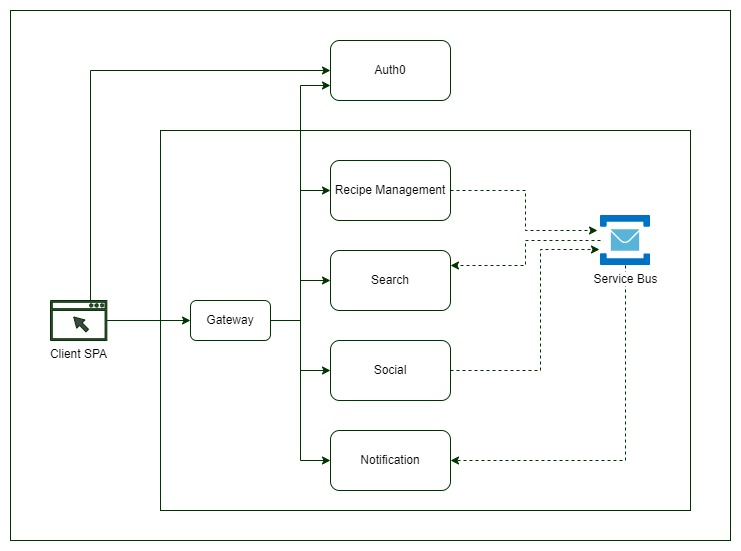
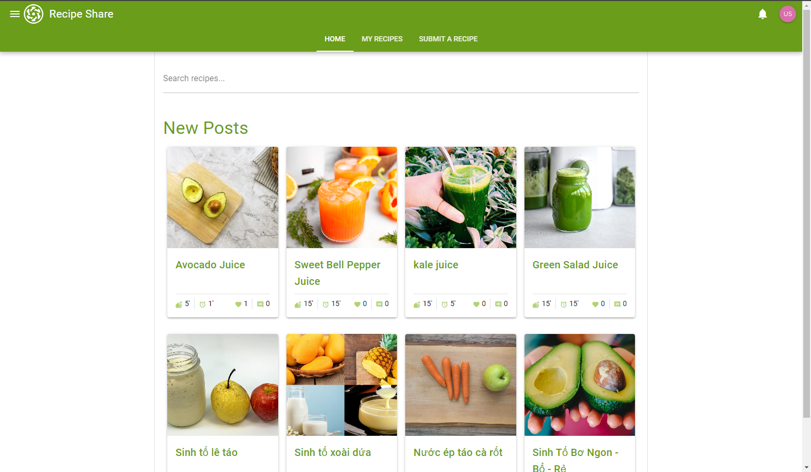

# Recipe Share

Recipe Share is a platform where users can discover, share, and explore recipes from around the world. It allows users to create profiles, share their own recipes, browse recipes by category, search for specific recipes, and interact with other users through comments and ratings.

This is a demo of how I build and deploy the microservices approach.

- [x] Built on .NET 8.0 LTS and Quasar frameworks
- [x] Microservices architectural style
- [x] JWT & Authentication with Auth0
- [x] Domain Driven Design building blocks
- [x] CQS with MediatR and Fluent Validations
- [x] Notification with SignalR
- [x] OpenAPI supports
- [x] Deploy to AKS with Heml
- [x] Manage TLS certificates with cert-manager
- [ ] CICD with Github actions





<p align="right">(<a href="#readme-top">back to top</a>)</p>

<!-- GETTING STARTED -->

## Getting Started

To get a local copy up and running follow these steps.

### Prerequisites

- Docker installed
- Auth0 free account
- Azure account
- .Net 8 installed
- Node 16 or higher
- Yarn installed
- Visual Studio
- Visual Studio Code

### Update configurations

#### Auth0

- Create an Auth0 application of type "Single Page Apps"
  - Allowed Callback URLs
    - http://localhost:9000
    - https://localhost:7100/swagger/oauth2-redirect.html
    - https://localhost:7200/swagger/oauth2-redirect.html
    - https://localhost:7300/swagger/oauth2-redirect.html
    - https://localhost:7400/swagger/oauth2-redirect.html
  - Allowed Web Origins
    - http://localhost:9000
    - https://localhost:7100
    - https://localhost:7200
    - https://localhost:7300
    - https://localhost:7400
  - Allowed Logout URLs
    - http://localhost:9000
- Update variables in the `client-app/variables/.env` file
  - `QUASAR_AUTH0_DOMAIN`
  - `QUASAR_AUTH0_CLIENT_ID`
- Create an Auth0 API
  - Identifier (this value will be used as the **_audience_** parameter on authorization)
    - recipe-share-api
      > Audience is the identity of your API application in Auth0. If it is not provided, an opaque access token will be returned instead. It is a token that does not have any payload. You cannot use that token to access your BE API. It will return 401.
- Create an Auth0 "Machine to Machine" application
  - Select the Auth0 API above as the API to authorize for invocation
  - After creating, on the app
    - Navigate to the APIs tab and enable "Authorized" for the **Auth0 Management API**
      - This is needed because our BE apps will use this M2M credential to get user info from Auth0
    - Click the "chevron down button" to expand the permissions section and select the **read:users**
- Update **Auth0** section in the `appsettings.json` files
  - `Domain`: your Auth0 domain
  - `Audience`: Identifier of the Auth0 API app above
  - `ClientId`: Client ID of the Machine to Machine app
  - `ClientSecret`: Client Secret of the Machine to Machine app
- Update **Swagger** section in the `appsettings.json` files
  - `Auth0`
    - `ClientId`: Client ID of the "Single Page Apps" above

#### Azure Service Bus and Storage Account

- Create an Service Bus
  - Update the **ConnectionStrings** section in `appsettings.json` files
    - `AzureServiceBus`: your Azure Service Bus connection string
- Create a Storage Account
  - On Azure Portal, go to the **Settings** blade of the storage account, select the **Resource Sharing (CORS)** sub-blade. Add CORS for the Blob service
    - Allowed origins: http://localhost:9000
    - Allowed methods: GET, HEAD, OPTIONS
    - Allowed headers: \*
    - Exposed headers:
    - Max age: 60
  - Update the **AzureStorage** section in `appsettings.json` files
    - `ConnectionString`: your Storage Account connection string

### Run BE services

1. Start ElasticSearch

```sh
cd ./Search/Search.API/docker
docker compose up
```

2. In VS, configure the start up projects
   1. Gateway
   2. Management.API
   3. Notification.Api
   4. Search.API
   5. Social.API

### Run FE

```sh
cd client-app
yarn
yarn quasar dev
```

<p align="right">(<a href="#readme-top">back to top</a>)</p>

<!-- LICENSE -->

## License

Distributed under the MIT License. See `LICENSE` for more information.

<p align="right">(<a href="#readme-top">back to top</a>)</p>

<!-- CONTACT -->

## Contact

Tung Nguyen - tungdn3@gmail.com

<p align="right">(<a href="#readme-top">back to top</a>)</p>
